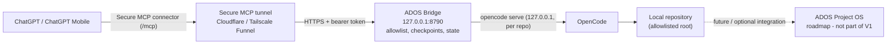

# ADOS Bridge

[](https://github.com/matiasgonzalovq/ados-bridge/actions/workflows/ci.yml)
[](LICENSE)
[](https://github.com/matiasgonzalovq/ados-bridge/tags)
[](package.json)
[](tsconfig.json)

**Supervised local execution: drive your own OpenCode from ChatGPT.** ADOS Bridge exposes a local
OpenCode session to ChatGPT over a secure MCP connection, so the model can read, edit and report
inside your own repositories while every destructive step stays behind an explicit human decision.

**Developed and maintained by Matías Valdebenito Quezada.**

> **Provenance:** ADOS Bridge is based on
> [opencode-chatgpt-bridge](https://github.com/yuga-hashimoto/opencode-chatgpt-bridge) by
> **yuga-hashimoto**, and remains **MIT**-licensed. The original copyright notice is preserved in
> [LICENSE](LICENSE); attribution and modification details are in [NOTICE](NOTICE).
> No ownership of the upstream code is claimed here.
> The npm package name and CLI binary remain `opencode-chatgpt-bridge`.

*If ADOS Bridge is useful to you, a star on the repository is the simplest way to help others find it.*

## Features

What is implemented and shipped in V1:

- **OpenCode session lifecycle** — start/stop a per-repository `opencode serve`, create and list
  sessions, send prompts (sync or async), fetch messages and diffs, abort. Streamable HTTP MCP at
  `/mcp` for ChatGPT connectors and other MCP clients; the session map persists in
  `~/.opencode-chatgpt-bridge/sessions.json`; agents, slash commands, and provider/model diagnostics
  are exposed through `opencode_capabilities`.
- **Operational state** — `opencode_state` derives `idle` / `busy` / `waiting-human` / `stalled` /
  `error` from session status, pending interventions, recent messages, and a bounded SSE reader per
  managed server, instead of a raw busy flag.
- **Human interventions and checkpoints** — pending permissions and questions are listed and answered
  explicitly (`opencode_list_interventions`, `opencode_respond_permission`, `opencode_answer_question`).
  Destructive tools return a checkpoint and only run with `confirmCheckpoint=true` (default on), and
  the bridge never picks an answer for you.
- **Idempotent messaging** — `opencode_send_message` accepts a `messageID`, so an ambiguous send can be
  retried without creating a second prompt; the bridge never retries a POST automatically.
- **Read-only Git evidence** — `opencode_git_status` and `opencode_git_diff` run local Git inside the
  authorized repo only (explicit args, no shell, no index mutation, credential-free environment) for
  branch, ahead/behind, staged/modified/untracked/deleted/renamed/conflicted files, and diffs.
- **Allowlisted repositories and security boundaries** — roots are realpath-checked against
  `OPENCODE_BRIDGE_ALLOWED_ROOTS` and re-validated on every call (deny by default), file reads stay
  inside the session repository, the bridge listens on `127.0.0.1`, the bearer token is masked
  everywhere except the explicit `show-token`, and `.env` / state files are written 0600 with atomic
  writes. This is an authorization boundary, **not** a sandbox — read the
  [Security model](#security-model).
- **Operations and tunneling** — optional Cloudflare quick tunnel, Tailscale Funnel flow, macOS
  LaunchAgent background mode, `doctor` diagnostics, and a printed setup guide on every start.
- **Engineering** — TypeScript, strict typecheck, unit tests, `pnpm run validate`.

## Architecture



Forward path:

```text
ChatGPT / ChatGPT Mobile
  -> Secure MCP (secure tunnel connector /mcp)
  -> ADOS Bridge (opencode-chatgpt-bridge, 127.0.0.1:8790)
  -> local opencode serve (127.0.0.1, per authorized repo)
  -> local repository
```

Return path:

```text
local repository
  -> opencode (edits, diff, status)
  -> ADOS Bridge (tool results, state, Git evidence)
  -> Secure MCP
  -> ChatGPT
```

Only the bridge is reachable from outside; OpenCode and the repository stay local. ADOS Project OS is
shown as a future/optional integration and is **not** part of this release.

This project is intentionally separate from ADOS Project OS. It is focused only on
the ChatGPT <-> opencode bridge use case. It is **not** a global project administration layer: it does
not track portfolio/progress, priorities, global governance, ActionIntent, or cross-project decisions
(see [V1 scope](#v1-scope)).

## Quick start

Requires Node.js 20+, pnpm 10+, and an authenticated `opencode` — see [Requirements](#requirements).

```bash
git clone https://github.com/matiasgonzalovq/ados-bridge.git
cd ados-bridge
pnpm install
pnpm run build
pnpm run init -- --allowed-roots /path/to/your/repos
pnpm start
```

`init` creates a ready-to-use `.env` with a random bridge token, your allowed repo roots, automatic port fallback, and Tailscale Funnel enabled by default.

When the bridge starts, it prints a setup guide with:

- local health URL
- local MCP URL
- automatic fallback port when the preferred port is already in use
- public HTTPS MCP URL when tunnel is enabled; Tailscale background service defaults to port 10000 to avoid conflicting with 443 and other active Funnel listeners
- ChatGPT settings link
- connector name, description, and URL to paste
- header auth (preferred); the token itself is always masked
- opencode CLI status and setup notes
- first ChatGPT prompt to try

## Requirements

- Node.js 20+
- pnpm 10+
- `opencode` installed and authenticated locally
- `cloudflared` for the default tunnel flow, or your own HTTPS tunnel

Check opencode:

```bash
opencode --version
opencode
```

Run `opencode` once inside a repo and make sure your model provider is configured before expecting ChatGPT to drive it. The bridge starts `opencode serve` for each repo and talks to it over HTTP. After creating a bridge session, call `opencode_capabilities` from ChatGPT to inspect connected providers, available auth methods, and default model configuration.

## Commands

```bash
opencode-chatgpt-bridge init --allowed-roots /path/to/repos
opencode-chatgpt-bridge start
opencode-chatgpt-bridge doctor
opencode-chatgpt-bridge show-token
```

From source, use pnpm:

```bash
pnpm run init -- --allowed-roots /path/to/repos
pnpm start
pnpm run doctor
node dist/cli.js show-token
```

`show-token` is the only command that prints the raw bridge token. `start`, `doctor`,
status output, and logs always show a masked value.

## Background mode on macOS

You do not need to keep a terminal open. Install the bridge as a user LaunchAgent:

```bash
pnpm run build
pnpm run install-service
pnpm run service-status
```

Logs are written to:

```text
~/.opencode-chatgpt-bridge/bridge.log
~/.opencode-chatgpt-bridge/bridge.err.log
```

To stop background mode:

```bash
pnpm run uninstall-service
```

The service uses this repository directory as its working directory, loads `.env`, starts the bridge, and keeps it alive after login.

## ChatGPT setup

Open ChatGPT Web and go to:

```text
https://chatgpt.com/#settings/Connectors
```

Manual path:

```text
Settings -> Apps & Connectors -> Advanced settings -> enable Developer mode
Settings -> Connectors -> Create
```

Use the values printed by the bridge. They look like this:

```text
Connector name: opencode local bridge
Description: Control local opencode sessions, inspect diffs, and manage local coding tasks.
Connector URL: https://example.trycloudflare.com/mcp
Bearer token: abcd…wxyz (masked)
```

The token is never printed in full by `start` or `doctor`.

If your ChatGPT connector UI supports auth headers, use the plain `/mcp` URL and set:

```text
Authorization: Bearer <OPENCODE_BRIDGE_TOKEN>
```

Header auth is the preferred mode. If your connector cannot send headers, print the
URL-token variants explicitly and append them to the MCP URL:

```bash
opencode-chatgpt-bridge show-token
# then use <connector-url>/<token> or <connector-url>?token=<token>
```

Once linked on ChatGPT Web, the connector should be available in ChatGPT mobile apps as well.

## opencode setup

No extra opencode project configuration is required by the bridge, but opencode itself must be usable locally.

The bridge starts opencode like this:

```bash
OPENCODE_SERVER_USERNAME=opencode \
OPENCODE_SERVER_PASSWORD=<generated-or-env-password> \
opencode serve --hostname 127.0.0.1 --port <auto>
```

Notes:

- If `OPENCODE_SERVER_PASSWORD` is not set, the bridge generates a random password per managed opencode server.
- If `OPENCODE_BASE_URL` is set, the bridge uses that existing opencode server instead of spawning one.
- The opencode server is kept on `127.0.0.1`; only the bridge is exposed to ChatGPT.
- Provider/model login is handled by opencode. Run `opencode` in an opencode TUI first (not the bridge) and confirm it can answer/edit before using ChatGPT.

### Attaching the opencode TUI (manual debugging)

The bridge never opens an opencode TUI and never attaches one automatically. For a manual
look at a server the bridge manages, run this yourself in a terminal:

```bash
opencode attach http://127.0.0.1:<port> -u <username> -p <password>
# or credentials from the environment:
OPENCODE_SERVER_USERNAME=opencode OPENCODE_SERVER_PASSWORD=<password> opencode attach http://127.0.0.1:<port>
```

Verified locally against opencode 1.18.30: attaching works and shows the live transcript, but it
needs an interactive TTY (it fails when run without one) and the credentials must be supplied
explicitly, otherwise it reports `401 Unauthorized`. Treat this as a human debugging step only.

## MCP tools

### Bridge and project tools

- `bridge_health` - inspect bridge config, managed opencode processes, event observers, and the stalled threshold.
- `list_projects` - list Git repos under the allowed roots.

### opencode process/session tools

- `opencode_start` - start or reuse an `opencode serve` process for a repo.
- `opencode_stop` - stop one or all managed opencode servers.
- `opencode_create_session` - create a new opencode session and return a `bridgeSessionId`.
- `opencode_list_sessions` - list bridge sessions known to this bridge.
- `opencode_get_session_status` - poll status for a session.
- `opencode_send_message` - send a prompt; defaults to async mode; accepts an optional `messageID` for idempotent retries.
- `opencode_get_messages` - fetch session transcript/messages.
- `opencode_get_diff` - fetch file diffs for a session.
- `opencode_abort` - abort a running session.
- `opencode_respond_permission` - respond to opencode permission prompts.
- `opencode_state` - derived operational state, pending interventions, activity, and last error for one session.
- `opencode_list_interventions` - pending opencode permissions and questions for one session.
- `opencode_answer_question` - answer a pending opencode question (checkpointed).

### project inspection tools

- `opencode_read_file` - read a file through opencode.
- `opencode_find_files` - fuzzy-find files through opencode.
- `opencode_vcs_status` - get VCS and file status.
- `opencode_git_status` - read-only Git evidence: branch, clean/staged/untracked/deleted/renamed/conflicted lists, ahead/behind.
- `opencode_git_diff` - read-only Git evidence: unstaged + staged diffs and untracked-file evidence (never via `git add`).
- `opencode_capabilities` - list opencode agents, slash commands, providers, auth methods, and default model config.

## Operational state

`opencode_get_session_status` reports what opencode itself says (`idle`, `busy`, `retry`). That is
not enough on its own: a session waiting for a human answer reports `busy`, and a session stuck
mid-run reports `busy` forever. Call `opencode_state` for the operational answer:

| State | Meaning |
| --- | --- |
| `idle` | Nothing pending and opencode is not busy. |
| `busy` | opencode is busy and there is recent activity (or no evidence of inactivity). |
| `waiting-human` | A permission or question is pending and needs an explicit human choice. |
| `stalled` | opencode is busy but nothing has been observed for longer than the threshold. |
| `error` | The newest observed signal is an error (message error or `session.error` event). |

Derivation order: pending intervention wins, then a fresh error, then busy vs stalled, else idle.
Signals come from `GET /session/status`, pending permissions/questions, the last 10 messages, and
the observed event stream. Fields the bridge cannot observe are `null` or `[]`; the report never
invents an operation, an error, or a repository authorization.

Configuration:

```bash
OPENCODE_BRIDGE_STALLED_MS=120000   # or --stalled-ms 120000; floor 5000
```

### Event stream observation

The bridge opens one SSE reader per managed opencode server (`GET /event`, basic auth), lazily on
the first `opencode_state` call, and stops it when that server stops or the bridge shuts down.
Readers reconnect with capped backoff, keep at most 50 sessions x 10 events, and only ever feed
operational state: no history, no control channel, nothing that can block a prompt. Server-level
events (heartbeats, plugins) never count as session activity.

### Interventions

`opencode_list_interventions` polls `GET /permission` and `GET /question` and filters them to the
session, so polling still works when the bridge attached to the event stream late.
`opencode_answer_question` posts the chosen labels (`answers` holds one array of option labels per
question) and is checkpointed: it returns a destructive checkpoint first and only runs with
`confirmCheckpoint=true`. Answering is always an explicit human choice; the bridge never picks an
option itself. An unknown question id surfaces opencode's 404 as an error, without retrying.

### Prompt idempotency

`opencode_send_message` accepts an optional `messageID`. When you retry after an ambiguous failure
(network error, timeout), resend with the **same** value: opencode dedupes prompt creation on that
id, and the bridge additionally checks whether the message already exists and returns
`duplicate: true` instead of sending again. The bridge never retries an ambiguous POST on its own.
The result also reports `stateTouch`, which says whether the bridge's own bookkeeping after the
send worked; a failed `stateTouch` never means the prompt was rejected.

## Git evidence (read-only)

`opencode_git_diff` and `opencode_get_diff` can differ, and neither shows untracked files. For real,
trustworthy repository evidence call `opencode_git_status` and `opencode_git_diff`. Both run **local Git**
inside the authorized session repo only (the `repoPath` re-validated by the current `allowedRoots` on
every call) and never mutate the index or working tree. Git is spawned with `execFile` (no shell),
explicit arguments, a 10s timeout, bounded output, and a credential-free environment
(`GIT_TERMINAL_PROMPT=0`, `GIT_OPTIONAL_LOCKS=0`), so the evidence reads never even take optional locks.

- `opencode_git_status` - branch, head, upstream, ahead/behind, `clean`, and the staged / modified /
  untracked / deleted / renamed / conflicted file lists plus `commitPending` / `pushPending`.
- `opencode_git_diff` - unstaged changes (`git diff`), staged changes (`git diff --cached`), and evidence
  for untracked files (detected with `git ls-files --others --exclude-standard`, shown via
  `git diff --no-index -- /dev/null <path>` — no `git add` is ever run).

Untracked evidence is containment-checked: a file is only read when it resolves strictly inside the
work-tree root; symlinks are never followed (an escape or symlink is reported with a `note` instead of
its content). A non-Git repo returns a structured `NOT_A_GIT_REPO` error rather than crashing.

## Example ChatGPT prompt

```text
Use opencode local bridge. First call bridge_health and list_projects.
Then create a session for /path/to/repos/my-repo,
ask opencode to fix the README, poll status, and show opencode_get_diff.
```

## Security model

This bridge can cause local code modifications through opencode. Treat it as a local automation gateway.

Default protections:

- `opencode` itself is bound to `127.0.0.1`.
- Repositories must be under `OPENCODE_BRIDGE_ALLOWED_ROOTS`, and every bridge session is
  re-checked against the roots active right now (deny by default, stale sessions cannot bypass it).
- Bearer-token authentication with header auth preferred; the raw token is masked in
  `start`, `doctor`, and status output and is printed only by the explicit `show-token` command.
- `.env` and the state file are written 0600 (owner-only); `doctor` warns if `.env` is wider.
- Destructive tools return a checkpoint (`isError: true`) and only proceed with `confirmCheckpoint=true`
  when checkpoints are enabled (default on; `OPENCODE_BRIDGE_CHECKPOINTS=false` or `--checkpoints false` disables).
  That covers `opencode_stop`, `opencode_abort`, `opencode_respond_permission`, and `opencode_answer_question`.
- No POST is retried automatically, so an ambiguous send can never silently create a second prompt;
  retries are explicit and keyed by `messageID`.
- File reads are always contained to the session repository; there is no escape hatch.
- No arbitrary shell execution tool is exposed by this bridge.
- Diffs are first-class so clients can inspect changes before committing.

Strongly recommended:

- Always set `OPENCODE_BRIDGE_TOKEN` before exposing through any tunnel.
- Do not bind the bridge to `0.0.0.0` unless you know exactly what network can reach it.
- Keep `OPENCODE_BRIDGE_ALLOWED_ROOTS` narrow.
- Review `opencode_get_diff` before committing or pushing generated changes.

## Development

```bash
pnpm install
pnpm run typecheck   # src/ and tests/ (tsconfig.json + tsconfig.test.json)
pnpm test
pnpm run build
pnpm run validate
```

## V1 scope

### Capabilities

- **Project allowlist**: repositories are gated by `OPENCODE_BRIDGE_ALLOWED_ROOTS` (realpath-checked)
  and re-validated on every call; a stale or unauthorized session is denied by default.
- **Bridge/OpenCode sessions**: one `bridgeSessionId` per OpenCode session, persisted in
  `~/.opencode-chatgpt-bridge/sessions.json`.
- **Sending instructions**: `opencode_send_message` (sync or async) with an optional **`messageID`**
  for idempotent retries (the bridge and OpenCode both dedupe on it; no ambiguous POST is retried
  automatically).
- **Operational state**: `opencode_state` derives `idle / busy / waiting-human / stalled / error` from
  session status, pending permissions/questions, recent messages, and the event stream.
- **SSE / events**: one bounded SSE reader per managed server (`GET /event`) for operational observation.
- **waiting-human**: surfaced when a permission or question is pending and needs an explicit human choice.
- **Permissions & questions**: `opencode_list_interventions` lists them; `opencode_respond_permission`
  and `opencode_answer_question` answer them behind a destructive checkpoint.
- **Abort**: `opencode_abort` stops a running session (checkpointed).
- **Checkpoints**: destructive tools require `confirmCheckpoint=true` (default on).
- **Git status / diff evidence** (read-only): `opencode_git_status` and `opencode_git_diff` read local Git
  inside the authorized repo — branch, ahead/behind, clean, staged/modified/untracked/deleted/renamed/
  conflicted, plus unstaged + staged diffs and untracked-file evidence (never via `git add`).
- **Containment**: Git runs in the authorized repo only; untracked file content is read only when it
  resolves inside the repo; symlinks are never followed; commands use explicit args (no shell).
- **Structured errors**: MCP failures return `isError: true` with an actionable message (e.g.
  `NOT_A_GIT_REPO`, `Unknown bridge session`).
- **Secure MCP**: the bridge runs on `127.0.0.1`; ChatGPT reaches `/mcp` through the Secure MCP connector.
- **OpenCode attach** for manual debugging: `opencode attach <url> -u <user> -p <pass>` in a terminal
  (interactive TTY; credentials required).

### Explicitly out of scope (belongs to ADOS Project OS)

- Mission Control, portfolio / global progress, priorities, or recommendations.
- Global governance and cross-project administration.
- ActionIntent from Project OS and product decisions.
- Managing or scheduling work across repositories.

ADOS Bridge V1 is the execution + evidence layer for a single local project; it deliberately does not
decide what to work on or across projects.

## Known limitations

- **Question / intervention E2E**: a real E2E was successfully verified: native OpenCode question ->
  opencode_state waiting-human -> explicit human approval in ChatGPT -> checkpoint ->
  opencode_answer_question -> OpenCode resumes -> session.idle. The `waiting-human` flow is
  covered by unit tests and surfaced correctly by `opencode_state` in runtime.
- **Unstaged renames**: `opencode_git_diff` may present an unstaged rename as delete + add (no `-M`),
  while `opencode_git_status` reports it correctly as a rename.
- **Rare path quoting**: paths with unusual characters may need more robust unquoting in `git diff`
  evidence; `core.quotepath=false` is applied via the Git environment.
- **Very large repositories**: status parsing caps entries (5000) and diff evidence caps files/patch size;
  evidence is operational and may not be exhaustive for huge repos.

## Roadmap

Direction of travel for ADOS Bridge. **Nothing in this section is shipped** — it is planning only, and
items may change or be dropped:

- **Secure tunnel autostart hardening** — make tunnel bring-up reliable across reboot/login (retry and
  health checks for the Cloudflare quick tunnel, cleaner Tailscale Funnel lifecycle, fail-loud startup
  when the public endpoint is not ready).
- **ADOS Project OS integration** — an optional layer that connects this V1 execution + evidence
  runtime to Project OS (mission control, priorities, ActionIntent). Explicitly out of scope for V1;
  ADOS Bridge stays usable standalone without it.
- **Packaging and onboarding** — a smoother install path (published package / single-command install),
  guided first-run onboarding, and a CI validation workflow running `pnpm run validate` on every push.

Track progress in [Issues](https://github.com/matiasgonzalovq/ados-bridge/issues); released
versions are tagged on the [Tags](https://github.com/matiasgonzalovq/ados-bridge/tags) page.

## Contributing

Contributions are welcome — see [CONTRIBUTING.md](CONTRIBUTING.md) for the short workflow
(fork, branch, `pnpm run validate`, focused pull request).

Before you start, note two non-negotiables:

- **Never commit secrets.** No `.env`, tokens, private keys, or credentials — `.env` is gitignored and
  only `.env.example` is tracked.
- **Security reports do not belong in issues or pull requests.** Follow [SECURITY.md](SECURITY.md).

## Security

See [SECURITY.md](SECURITY.md) for responsible disclosure guidance. In short: use GitHub private
vulnerability reporting if it is enabled for this repository; otherwise open a minimal, non-sensitive
issue asking for a private contact path. Never post secrets, tokens, or exploit details publicly.

## License

MIT — see [LICENSE](LICENSE). The original MIT license text and
`Copyright (c) 2026 yuga-hashimoto` are preserved exactly as provided upstream.

ADOS Bridge is based on [opencode-chatgpt-bridge](https://github.com/yuga-hashimoto/opencode-chatgpt-bridge)
by yuga-hashimoto. Modifications and additional ADOS Bridge development are
`Copyright (c) 2026 Matías Valdebenito Quezada`, released under the same MIT terms.
See [NOTICE](NOTICE) for the full attribution statement.
